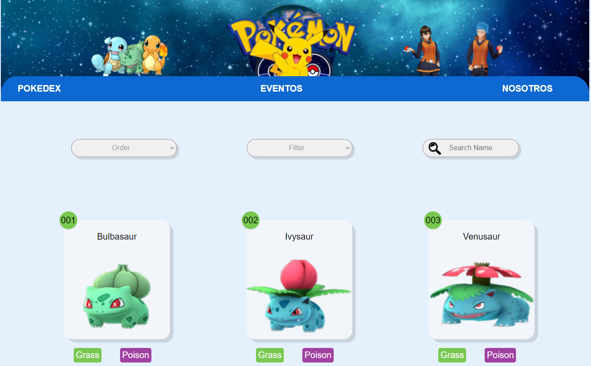

# Data Lovers

# POKEMON

# INDICE
* [1. Preámbulo](#1-preámbulo)
* [2. Resumen del proyecto](#2-resumen-del-proyecto)
* [3. Objetivos de aprendizaje](#3-objetivos-de-aprendizaje)
* [4. Criterios de aceptación mínimos del proyecto](#4-criterios-de-aceptación-mínimos-del-proyecto)
* [5. Diseño de Interfaz de Usuario](#5-diseño-de-interfaz-de-usuario)
* [6. Consideraciones técnicas](#6-consideraciones-técnicas)
* [7. Pistas, tips y lecturas complementarias](#7-pistas-tips-y-lecturas-complementarias)
*


# 1. Preámbulo

Según [Forbes](https://www.forbes.com/sites/bernardmarr/2018/05/21/how-much-data-do-we-create-every-day-the-mind-blowing-stats-everyone-should-read),
el 90% de la data que existe hoy ha sido creada durante los últimos dos años.
Cada día generamos 2.5 millones de terabytes de datos, una cifra sin
precedentes.

No obstante, los datos por sí mismos son de poca utilidad. Para que esas
grandes cantidades de datos se conviertan en **información** fácil de leer para
los usuarios, necesitamos entender y procesar estos datos. Una manera simple de
hacerlo es creando _interfaces_ y _visualizaciones_.

## 2. Resumen del proyecto
  * Se realizo un estudio de nuestros usuarios para validar lo que desea encontrar en nuestra página.
  * Creamos una aplicacion que permite a los usuarios conocer información a detalle(tipo, debilidades, estatura,ataque ,etc) en el cual podra ordenar alfabeticamente, filtrar por tipo y buscar cada pokemon.
  * Pokémon: En este set encontrarás una lista con los 251 Pokémon de la región de Kanto y Johto, junto con sus respectivas estadísticas usadas en el juego Pokémon GO.

    
     
  
  [Pokémon GO](http://pokemongolive.com).
  - [Investigación con jugadores de Pokémon Go](/src/data/pokemon/README.md)


## 3. Objetivos de aprendizaje

### HTML y CSS

* [ x] [Uso de HTML semántico.](https://developer.mozilla.org/en-US/docs/Glossary/Semantics#Semantics_in_HTML)
* [ x] [Uso de selectores de CSS.](https://css-tricks.com/almanac/selectors/)
* [ x] Construir tu aplicación respetando el diseño realizado (maquetación).
* [ x] [Uso de flexbox en CSS.](https://css-tricks.com/snippets/css/a-guide-to-flexbox/)

### DOM y Web APIs

* [ x] [Uso de selectores del DOM](https://developer.mozilla.org/es/docs/Referencia_DOM_de_Gecko/Localizando_elementos_DOM_usando_selectores).
* [ x] [Manejo de eventos del DOM.](https://www.w3schools.com/js/js_events.asp)
* [ x] [Manipulación dinámica del DOM.](https://developer.mozilla.org/es/docs/Referencia_DOM_de_Gecko/Introducci%C3%B3n)
(appendChild |createElement | createTextNode| innerHTML | textContent | etc.)

### JavaScript

* [ x] Uso de condicionales (if-else | switch | operador ternario)
* [ x] [Uso de bucles (for | for..in | for..of | while)](https://developer.mozilla.org/es/docs/Web/JavaScript/Guide/Bucles_e_iteraci%C3%B3n)
* [ x] [Uso de funciones (parámetros | argumentos | valor de retorno)](https://developer.mozilla.org/es/docs/Web/JavaScript/Referencia/Funciones)
* [ ]x [Manipular arrays (filter | map | sort | reduce)](https://code.tutsplus.com/es/tutorials/how-to-use-map-filter-reduce-in-javascript--cms-26209)
* [ x] [Manipular objects (key | value)](https://developer.mozilla.org/es/docs/Web/JavaScript/Referencia/Objetos_globales/Object)
* [ ] [Uso ES modules](https://developer.mozilla.org/es/docs/Web/JavaScript/Guide/M%C3%B3dulos) ([`import`](https://developer.mozilla.org/en-US/docs/Web/JavaScript/Reference/Statements/import)
| [`export`](https://developer.mozilla.org/en-US/docs/Web/JavaScript/Reference/Statements/export))
* [ x] [Diferenciar entre expression y statements.](https://openclassrooms.com/en/courses/4309531-descubre-las-funciones-en-javascript/5108986-diferencia-entre-expresion-y-sentencia)
* [ ] [Diferenciar entre tipos de datos atómicos y estructurados.](https://developer.mozilla.org/es/docs/Web/JavaScript/Data_structures)

### Testing

* [ x] [Testeo unitario.](https://jestjs.io/docs/es-ES/getting-started)

### Estructura del código y guía de estilo

* [ ] [Organizar y dividir el código en módulos (Modularización)](https://medium.com/@sebastianpaduano/modularizaci%C3%B3n-en-javascript-538bd6c75fa)
* [ x] Uso de linter (ESLINT)

### Git y GitHub

* [ x] [Uso de comandos de git (add | commit | pull | status | push)](https://github.com/jlord/git-it-electron)
* [ x] Manejo de repositorios de GitHub (clone | fork | gh-pages)
* [ x] Colaboración en Github (branches | pull requests | |[tags](https://git-scm.com/book/en/v2/Git-Basics-Tagging))

### UX

* [ x] Diseñar la aplicación pensando y entendiendo al usuario.
* [ x] Crear prototipos para obtener feedback e iterar.
* [ x] Aplicar los principios de diseño visual (contraste, alineación, jerarquía)
* [ x] Planear y ejecutar tests de usabilidad.

### Buenas prácticas de desarrollo
* [x] Organizar y dividir el código en módulos (Modularización).
* [x] Utilizar identificadores descriptivos (Nomenclatura | Semántica).
* [x] Utilizar linter para seguir buenas prácticas (ESLINT).

# 4. Criterios de aceptación mínimos del proyecto
  ##  Definición del producto
  ### Usuarios 
    Niños jovenes, adultos  (Desde los 6 - 45años) que deseen navegar en una web confiable y agradable para obtener información a detalle los movimientos, ataques y caracteristicas de los pokemones para convertirse en un mejor maestro pokemon.
     
  ### Objetivos del proyecto 
  * Que los usuarios puedan tener una herramienta donde consultar informacion de pokemones .
  * Reconocer a los pokemones de mejor puntaje para poder ganar una batalla y ser un mejor jugador en pokemon .
  * Puedan tener una navegación intuitiva.
  * Información veridica y confiable para los usuarios.

  ### Problemas que soluciona 
    * Mostrar 251 pokemons en la pagina principal y que cada uno muestre tres características principales (imagen, número de pokemon, nombre y tipo)
    * Mostrar información a detalle de cada pokemon mediante una ventana modal 
    * En el modal aparecen un calculo del promedio de puntos que tiene cada pokemon para conocer que tan buen rendimiento tiene ese pokemon
    * Se presentara una gráfico con los stats de cada pokemon 
    * Mostrar evolucion y tipo
    * Filtrar por Tipo 
    * Ordenar pokemons alfabéticamente de A-Z
    * Ordenar pokemons alfabéticamente de Z-A
    * Buscar por nombre a un pokemon

## Historias de Usuario 
## HU1: Mostrar todos los pokemones
### Yo, como usuario quiero poder visualizar todos los pokemones que existen
 #### Criterios de Aceptación
 * El usuario podrá visualizar a todos los pokemones con su respectiva imagen, nombre y número de posición y tipo de pokemon
 #### Definición de terminado
   * Eslint con 0 errores
   * Testear las funciones y que salgan sin error
   ### HU2: Mostrar los datos a detalle de cada pokemon
   * Yo como usuario quiero obtener información a detalle de cada pokemon al hacer click en su imagen.
   para conocer sobre el peso, altura,  tipo, resistencia, debilidad, movimientos y evoluciones de cada pokemón.
   #### Criterios de Aceptación
   * El usuario visualiza la información detallada del pokemón en una interfaz superpuesta.
   * El usuario puede visualizar las evoluciones del pokemón y también puede acceder a su información a detalle.
   #### Definición de terminado
   * Eslint con 0 errores
   * Testear las funciones 
    ### HU3: Filtrar pokemons por tipo 
    #### Historia de Usuario 
   * Yo como usuario quiero filtrar pokemons por tipo de elemento para conocer aquellos que son del elemento agua, aire, fuego, etc.
   #### Criterios de Aceptación
   * El usuario observa en el navegador la opción tipo y al hacer click se despliega las opciones de los diferentes tipos de elementos
   * El usuario al hacer click en las opciones, filtra los correspondientes a cada tipo de elemento.
   #### Definición de terminado
   * Eslint con 0 errores
   * Testear las funciones
   ### HU4: Ordenar pokemons alfabeticamente

 #### Historia de Usuario 
   * Yo como usuario quiero ordenar alfabéticamente de la A-Z y de la Z-A a los pokemons para ubicarlos rápido si no sé cómo se escribe el nombre completo.
   #### Criterios de Aceptación
   * El usuario observa un select en la parte superior derecha y tiene las opciones ordenar de la A-Z y de Z-A
   * El usuario al hacer click en las opciones, ordena de manera que corresponda a la opción seleccionada.
   #### Definición de terminado
   * Eslint con 0 errores
   * Testear las funciones 
    ### HU5: Un buscador para filtrar el pokemon por nombre.
     #### Historia de usuario
   * Yo como usuario quiero buscar un pokemon por su nombre para Facilitar la búsqueda.
   #### Criterios de aceptación
   * El usuario observa en la barra de navegación al lado derecho un buscador
   * El usuario escribe el nombre del pokemon que desea 
   * El usuario escribe el nombre del pokemon y este se autocompleta
   * El usuario obtiene al pokemon buscado
   #### Definición de terminado
   * Eslint con 0 errores
   * Testear las funciones

## 5. Diseño de Interfaz de Usuario

#### Prototipo de baja fidelidad
   

#### Prototipo de alta fidelidad
   [Prototipo de alta fidelidad](https://www.figma.com/file/NkYxg5wcMgVuGTowpfwaFU/Pokemon?node-id=0%3A1),
    
#### Testeos de usabilidad

Durante el reto deberás hacer _tests_ de usabilidad con distintos usuarios, y
en base a los resultados, deberás iterar tus diseños. Cuéntanos
qué problemas de usabilidad detectaste a través de los _tests_ y cómo los
mejoraste en tu propuesta final.

### Implementación de la Interfaz de Usuario (HTML/CSS/JS)

Luego de diseñar tu interfaz de usuario deberás trabajar en su implementación.
Tu tiempo de hacking es escaso, así que deberás priorizar

Como mínimo, tu implementación debe:

1. Mostrar la data en una interfaz: puede ser un card, una tabla, una lista,
   etc.
2. Permitir al usuario interactuar para obtener la infomación que necesita.
3. Ser _responsive_, es decir, debe visualizarse sin problemas desde distintos
   tamaños de pantallas: móviles, tablets y desktops.
4. Que la interfaz siga los fundamentos de _visual design_.
  
  
  

### Pruebas unitarias

El _boilerplate_ de este proyecto no incluye Pruebas Unitarias (_tests_), así es
que  tendrás que escribirlas tú para las funciones encargadas de  _procesar_,
_filtrar_ y _ordenar_ la data, así como _calcular_ estadísticas.

Tus _pruebas unitarias_ deben dar una cobertura del 70% de _statements_
(_sentencias_), _functions_ (_funciones_), _lines_ (_líneas_), y _branches_
(_ramas_) del archivo `src/data.js` que contenga tus funciones y está detallado
en la sección de [Consideraciones técnicas](#srcdatajs).


## 6. Consideraciones técnicas

La lógica del proyecto debe estar implementada completamente en JavaScript
(ES6), HTML y CSS. En este proyecto NO está permitido usar librerías o
frameworks, solo [vanilla JavaScript](https://medium.com/laboratoria-how-to/vanillajs-vs-jquery-31e623bbd46e),
con la excepción de librerías para hacer gráficas (charts);

No se debe utilizar la _pseudo-variable_ `this`.

El _boilerplate_ contiene una estructura de archivos como punto de partida así
como toda la configuración de dependencias:

|  |  |  ├── pokemon.js
|  |  |  ├── pokemon.json
|  |  |  └── README.md
|  |  └── rickandmorty
|  |     ├── rickandmorty.js
|  |     └── rickandmorty.json
|  |     └── README.md
|  |  └── athletes
|  |     ├── athletes.js
|  |     └── athletes.json
|  |  └── atletas
|  |     ├── atletas.js
|  |     └── atletas.json
|  |     └── README.md
|  ├── data.js
|  ├── index.html

### `src/index.html`

Como en el proyecto anterior, existe un archivo `index.html`. Como ya sabes,
acá va la página que se mostrará al usuario. También nos sirve para indicar
qué scripts se usarán y unir todo lo que hemos hecho.

### `src/main.js`

Recomendamos usar `src/main.js` para todo tu código que tenga que ver con
mostrar los datos en la pantalla. Con esto nos referimos básicamente a la
interacción con el DOM. Operaciones como creación de nodos, registro de
manejadores de eventos (_event listeners_ o _event handlers_), ....

Esta no es la única forma de dividir tu código, puedes usar más archivos y
carpetas, siempre y cuando la estructura sea clara para tus compañeras.

En este archivo encontrarás una serie de _imports_ _comentados_. Para _cargar_
las diferentes fuentes de datos tendrás que _descomentar_ la línea
correspondiente.

Por ejemplo, si "descomentamos" la siguiente línea:

```js
 // import data from './data/pokemon/pokemon.js';
```

La línea quedaría así:

```js
// import data from './data/pokemon/pokemon.js';
```

Y ahora tendríamos la variable `data` disponible en el script `src/main.js`.

### `src/data.js`

El corazón de este proyecto es la manipulación de datos a través de arreglos
y objetos.

Te recomendamos que este archivo contenga toda la funcionalidad que corresponda
a obtener, procesar y manipular datos (tus funciones). Por ejemplo:

* `filterData(data, condition)`: esta función `filter` o filtrar recibiría la
  data, y nos retornaría aquellos datos que sí cumplan con la condición.

* `sortData(data, sortBy, sortOrder)`: esta función `sort` u ordenar
  recibe tres parámetros.
  El primer parámetro, `data`, nos entrega los datos.
  El segundo parámetro, `sortBy`, nos dice con respecto a cuál de los campos de
  la data se quiere ordenar.
  El tercer parámetro, `sortOrder`, indica si se quiere ordenar de manera
  ascendente o descendente.

* `computeStats(data)`: la función `compute` o calcular, nos permitirá hacer
  cálculos estadísticos básicos para ser mostrados de acuerdo a la data
  proporcionada.

Estos nombres de funciones y de parámetros son solamente referenciales, lo que
decidas depende de tu propia implementación.

Estas funciones deben ser [_puras_](https://medium.com/laboratoria-developers/introducci%C3%B3n-a-la-programaci%C3%B3n-funcional-en-javascript-parte-2-funciones-puras-b99e08c2895d)
e independientes del DOM. Estas funciones serán después usadas desde el archivo
`src/main.js`, al cargar la página, y cada vez que el usuario interactúe (click,
filtrado, ordenado, ...).

### `src/data`

En esta carpeta están los datos de las diferentes fuentes. Encontrarás una
carpeta por cada fuente, y dentro de cada carpeta dos archivos: uno con la
extensión `.js` y otro `.json`. Ambos archivos contienen la misma data; la
diferencia es que el `.js` lo usaremos a través de una etiqueta `<script>`,
mientras que el `.json` está ahí para opcionalmente cargar la data de forma
asíncrona con [`fetch()`](https://developer.mozilla.org/es/docs/Web/API/Fetch_API)
(ver sección de [_Parte Opcional_](#6-hacker-edition)).

### `test/data.spec.js`

Tendrás también que completar las pruebas unitarias de las funciones
implementadas en el archivo `data.js`.

## 7. Pistas, tips y lecturas complementarias

### Primeros pasos

Antes de empezar a escribir código, debes definir qué deberá hacer el producto
en base al conocimiento que puedas obtener de tu usuario. Estas preguntas te
pueden ayudar:

* ¿Quiénes son los principales usuarios de producto?
* ¿Cuáles son los objetivos de estos usuarios en relación con el producto?
* ¿Cuáles son los datos más relevantes que quieren ver en la interfaz y por qué?
* ¿Cuándo utilizan o utilizarían el producto?
* Toda tu investigación previa debe tener como resultado todas las Historias
  de Usuario de tu proyecto.
* No hagas los prototipos de alta fidelidad de todas tus Historias. Comienza
  solamente por los que se necesiten para tu Sprint 1 (semana 1 de trabajo). Más
  pistas en la guía de organización para el proyecto.

Cuando ya estés lista para codear, te sugerimos empezar de esta manera:

1. Una de las integrantes del equipo debe realizar un :fork_and_knife:
   [fork](https://help.github.com/articles/fork-a-repo/) del repo de tu cohort,
   tus _coaches_ te compartirán un _link_ a un repo y te darán acceso de lectura
   en ese repo. La otra integrante del equipo deber hacer un fork **del
   repositorio de su compañera** y
   [configurar](https://gist.github.com/BCasal/026e4c7f5c71418485c1) un `remote`
   hacia el mismo.
2. :arrow_down: [Clona](https://help.github.com/articles/cloning-a-repository/)
   tu *fork* a tu computadora (copia local).
3. 📦 Instala las dependencias del proyecto con el comando `npm install`. Esto
   asume que has instalado [Node.js](https://nodejs.org/) (que incluye [npm](https://docs.npmjs.com/)).
4. Si todo ha ido bien, deberías poder ejecutar las :traffic_light:
   pruebas unitarias (unit tests) con el comando `npm test`.
5. Para ver la interfaz de tu programa en el navegador, usa el comando
  `npm start` para arrancar el servidor web y dirígete a
  `http://localhost:5000` en tu navegador.
6. A codear se ha dicho! :rocket:
